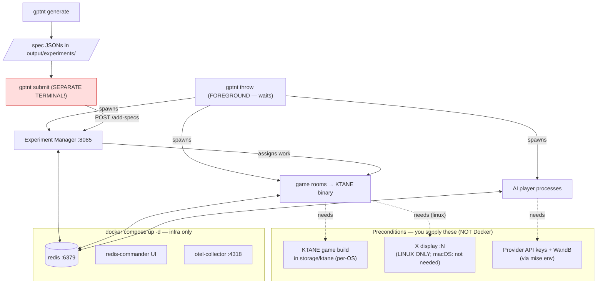

# GPTNT

GPTNT benchmarks LLM "players" cooperating to defuse bombs in [_Keep Talking and Nobody
Explodes_](https://keeptalkinggame.com/) (KTANE). The repository **generates** experiment specs,
**throws** game rooms and AI players at them, **records** every run, and lets you **analyse** the
results. This README is everything you need to set it up and run it from a clean clone.

> [!NOTE]
> We've tried hard to make this _ItJustWorks™_ — tests, formatters, linters, and CI all guard the
> codebase. If something doesn't work, please open an issue.

## How it fits together

Three things run, and **only one of them is Docker**:



The single biggest gotcha: **`gptnt throw` runs in the foreground and waits — nothing happens until
you run `gptnt submit` in a second terminal.** Docker only runs infra (Redis, its web UI, and the
OpenTelemetry collector); the **game rooms are local processes** spawned by `throw` from a game
binary **you** provide.

## Prerequisites

- **[uv](https://docs.astral.sh/uv/)** and **Python ≥ 3.13** (we pin `>=3.13, <3.14`). We recommend
  [mise](https://mise.jdx.dev) to pin the toolchain and manage secrets — `mise install` reads the
  versions from `mise.toml`'s `[tools]`.
- **Docker** (for `docker compose up -d`).
- **The KTANE game build**, placed under `storage/ktane`. We **do not distribute it** — it is a
  precondition, not something a command provisions. The per-OS layout is:
  - Linux: `<name>.x86_64` next to a `<name>_Data/` directory
  - macOS: `<name>.app/Contents/MacOS/<exe>`
  - Windows: `<name>.exe`

  If the binary is missing you'll get a `GameNotFoundError` naming `storage/ktane`.
- **Linux only — an X display.** The game needs some X display. If you already have a desktop session
  (`$DISPLAY` set) it'll be used; on a headless box, start a GPU-backed Xorg with `scripts/startx.py`.
  **macOS and Windows need nothing here.**

<details>
<summary><b>Pin the toolchain with mise (recommended)</b></summary>

```bash
mise use python@3.13 uv@latest
```

</details>

## Install

Install all packages and dependency groups in one go:

```bash
uv sync --all-groups
```

(Equivalently, `mise run install` / `mise i`.) This installs the whole uv workspace — `gptnt-cli`,
`gptnt-core`, `gptnt-interactive`, `gptnt-records`, `gptnt-app`, and `gptnt-statics` — and exposes a
single `gptnt` command.

Verify it:

```bash
uv run python -m gptnt     # or just: gptnt --help
gptnt models               # list every available model config
```

## Configure secrets (mise)

GPTNT reads provider keys and WandB credentials from the **environment**. The recommended way to set
them is a `mise.local.toml` file at the repo root — it's **gitignored**, so your keys can never be
committed:

```toml
# mise.local.toml  (gitignored — never commit secrets)
[env]
ANTHROPIC_API_KEY = "sk-ant-..."   # only set the keys for providers you actually run
OPENAI_API_KEY    = "sk-..."
GOOGLE_API_KEY    = "..."

WANDB_API_KEY     = "..."          # results are recorded to Weights & Biases
WANDB_ENTITY      = "your-entity"
WANDB_PROJECT     = "your-project"

# LOGFIRE_TOKEN   = "..."          # optional — only if exporting traces to Logfire
```

You only need keys for the providers you intend to run. For other backends (Azure, AWS Bedrock,
self-hosted vLLM, …), consult [pydantic-ai's models/providers
docs](https://ai.pydantic.dev/models/) for the exact environment variable each one expects — GPTNT
constructs models through pydantic-ai, so anything it supports works here.

> [!CAUTION]
> Never commit API keys. Both `mise.local.toml` and `.mise.toml` are gitignored — keep it that way.
> If you'd rather not use mise, plain `export VAR=...` in your shell works identically.

## Bring your own model

A "model" is a small Hydra config under `configs/model/<name>.yaml`. The fastest way to add one is to
copy an existing config (e.g. `configs/model/claude46.yaml`) and edit it:

```yaml
# @package player
defaults:
  - _self_

capabilities:
  player_name: claude46          # MUST match the config's file name stem
  thinking_method: thinking-out-loud
  interaction_location_method: set-of-marks
  usage_limits:
    input_tokens_limit: 200000
    output_tokens_limit: 64000

action_predictor:
  agent:
    model:
      _target_: pydantic_ai.models.anthropic.AnthropicModel
      model_name: claude-sonnet-4-6
```

The `capabilities:` block describes how the player behaves (vision / set-of-marks, thinking method,
token limits); `action_predictor.agent.model` is the pydantic-ai model that gets instantiated. Run
`gptnt models` to see everything that's discoverable.

### Configs with a provider

A **provider** override (`configs/model/provider/<name>.yaml`) points a model at a specific inference
backend or endpoint — used for self-hosted / vLLM / proxy deployments. For example, a vLLM box:

```yaml
# @package player.action_predictor.agent.model
provider:
  _target_: pydantic_ai.providers.openai.OpenAIProvider
  base_url: https://box1.gptnt.space/v1
```

You attach a provider to a model at runtime with the `MODEL@PROVIDER` syntax. The roster string used
by `gptnt throw` is `MODEL[@PROVIDER][:COUNT]`:

- `MODEL` — a config in `configs/model/*.yaml`
- `@PROVIDER` — (optional) an override in `configs/model/provider/*.yaml`; omit to use the model's
  default provider
- `:COUNT` — (optional) number of player processes for that model (default `1`)

The roster that **experiment generation** draws from lives in `configs/experiment_generator.yaml`
(`players.all`), with reference anchors in `configs/anchors.yaml`.

## Run the benchmark end-to-end

**1. Start infra** (Redis + its web UI + the OpenTelemetry collector — **not** the game):

```bash
docker compose up -d
```

The active compose profile defaults to `prod` (`COMPOSE_PROFILES=prod`, set in `mise.toml`).

**2. Generate experiment specs** as JSON into `output/experiments/`:

```bash
gptnt generate experiment=e0-async        # any preset in configs/experiment/*.yaml
```

**3. Throw** the game rooms and AI players. This runs in the **foreground** — it spawns the
experiment manager (`:8085`), the game rooms, and the players, then **waits**:

```bash
gptnt throw 4 claude46:4 gemini-3:4
```

**4. Submit** the specs — **in a separate terminal**. This is what actually starts the games (the EM
sits idle until it receives them). `WANDB_ENTITY` / `WANDB_PROJECT` are picked up from your mise env:

```bash
gptnt submit
```

> [!IMPORTANT]
> **Why does `throw` seem to hang?** It's waiting for `submit`. `throw` spawns the manager, rooms,
> and players and then blocks; until `submit` POSTs the specs to the EM, there's no work to assign
> and no games run. This is expected — open a second terminal and run `gptnt submit`.

Other useful commands: `gptnt status` (check run progress on WandB), `gptnt kill` (force-kill stuck
game/player processes), `gptnt cleanup-outputs` (consolidate outputs and WandB runs).

## Analyse results

Build the local DuckDB database from the recorded runs, then open the Streamlit dashboard:

```bash
gptnt build-db output/experiment_recorder_outputs/
gptnt analyse
```

`gptnt timing` summarises LLM inference time vs. framework overhead for a run.

## Static evaluations (no game needed)

`gptnt statics` runs model evaluations against HuggingFace datasets (VQA, grounding, OCR, …). These
need only model configs + API keys — no Redis, game binary, or display. See
[docs/how-to-run-statics.md](docs/how-to-run-statics.md).

## Observability

Each process emits OTLP spans to the otel-collector on `localhost:4318`, which (under the `prod`
profile) exports them to [Logfire](https://logfire.pydantic.dev/) using `LOGFIRE_TOKEN`. Pass
`gptnt throw --limit-observability` to cut span volume. To send traces to a non-Logfire backend,
point the collector's exporters in `storage/otel-collector-config.yaml` at any OTLP destination. See
[docs/how-to-observability.md](docs/how-to-observability.md).

## Troubleshooting

| Symptom | Cause → Fix |
| --- | --- |
| `throw` sits there doing nothing | It's waiting for specs → run `gptnt submit` in another terminal. |
| `GameNotFoundError` | No game build → place the KTANE build under `storage/ktane` (see Prerequisites). |
| Connection refused on `:6379` | Redis isn't up → `docker compose up -d`. |
| No X display (Linux) | `$DISPLAY` unset on a headless box → start one with `scripts/startx.py`. |
| Auth / 401 from a provider | Missing key → set it in `mise.local.toml` (e.g. `ANTHROPIC_API_KEY`). |
| Stuck game/player processes | `gptnt kill` to force-kill them. |

## How to verify everything is working

We develop test-first; **run the tests when setting up a new machine.**

```bash
uv run pytest --collect-only   # confirms install + discovers all tests
uv run pytest                  # the CI runs the exact same way
```

## How to run the code quality tools

We use Ruff, [wemake-python-styleguide](https://wemake-python-styleguide.readthedocs.io/),
[basedpyright](https://docs.basedpyright.com/), and a set of pre-commit hooks (including
[conventional commits](https://www.conventionalcommits.org/)).

Run everything across the repo with:

```bash
uv run prek run -a
```

<details>
<summary><b>Recommended VSCode defaults</b></summary>

Recommended extensions and settings live in `.vscode/` (`extensions.json`,
`settings.recommended.json`). Copy the recommended settings into your `.vscode/settings.json` and
install the recommended extensions. If you use basedpyright, disable the Pylance extension.

</details>

## How to contribute code

TBA.

## License

## Citation
