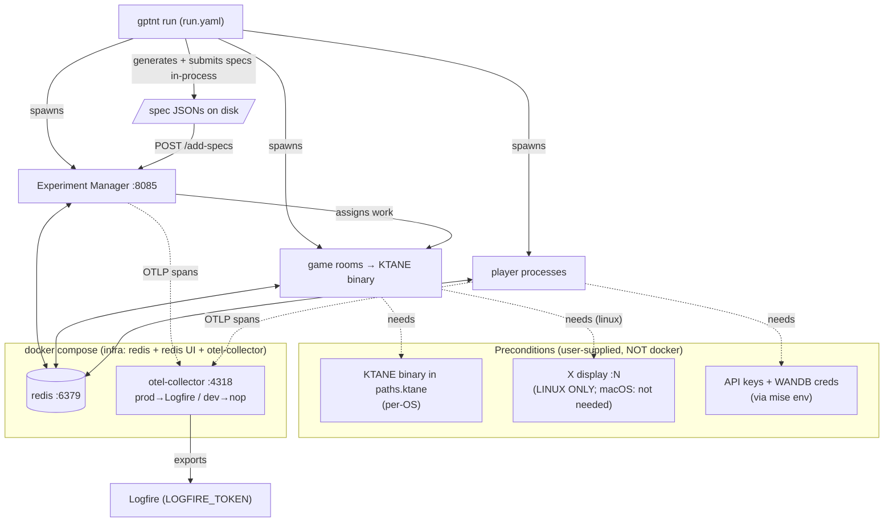

# GPTNT — what this is

GPTNT is an AI benchmark built on **KTANE** ("Keep Talking and Nobody Explodes"): a co-op bomb-defusal game where a _Defuser_ who can see the bomb and an _Expert_ who can read the manual must talk to each other to defuse it. Here, the players are AI models. You run **experiments** that pair models against bombs and record how well they do. The job of this repo is to generate those experiments, run them, and collect the results.

## How it fits together

<!-- The canonical source for this diagram is docs/pipeline.mmd. Keep the two in sync. -->



There are **three layers, and only one of them is Docker**:

1. **Infra services in Docker.** `docker compose up -d` starts Redis (`localhost:6379`), a Redis web UI (redis-commander), and an OTEL collector. That is _all_ Docker does.
2. **The KTANE game binary**, which you supply. It is platform-specific, not distributed with this repo, and not installed by any command. It lives under `paths.ktane` (`storage/ktane`).
3. **A display** for the game to render into — **a Linux-only concern**, and only when the machine is headless. macOS and Windows need nothing here.

> [!IMPORTANT]
> **Docker does NOT run the game.** The game rooms are plain local subprocesses spawned by `gptnt run` — they live _outside_ Docker and they launch your KTANE binary directly.

**Observability lane:** every process emits OTLP spans to the collector at `localhost:4318`; the collector (in Docker) forwards them to [Logfire](https://logfire.pydantic.dev/). Logfire is for traces/spans (debugging). WandB is for experiment results — they are different things.

## Preconditions

### 1. Docker (infra)

You need Docker running so `docker compose up -d` can start Redis + the Redis UI + the OTEL collector. Again: this starts infra **only**, not the game.

### 2. The KTANE game binary (you supply this)

The game is **not** distributed here and **not** provisioned by any command — it is a precondition. Drop your platform's KTANE build under `paths.ktane` (`storage/ktane`). It is discovered by `packages/gptnt-core/src/gptnt/core/ktane/executable.py` (`get_executable_path`), which raises `GameNotFoundError` if it cannot find one.

| OS      | Expected layout under `storage/ktane`     |
| ------- | ----------------------------------------- |
| Linux   | `*.x86_64` plus a `ktane_Data/` directory |
| macOS   | `*.app/Contents/MacOS/<exe>`              |
| Windows | `*.exe`                                   |

### 3. A display (Linux only)

The game has to render somewhere.

- **macOS / Windows:** nothing to do.
- **Linux with a desktop session:** if `$DISPLAY` is already set, the game uses it — nothing to do.
- **Linux, headless:** start a GPU-backed Xorg with `scripts/startx.py`, then either export `$DISPLAY` for the run to inherit, or name the display(s) in the run manifest (`displays: [N]`, one per GPU to spread rooms across GPUs).

### 4. Keys (via mise, not `.env`)

Secrets are **mise-managed**. There is no `.env` file here — do not create one. Put your keys in `mise.local.toml` under `[env]` (which is git-ignored), or export them in your shell:

```toml
# mise.local.toml
[env]
ANTHROPIC_API_KEY = "sk-..."
WANDB_API_KEY = "..."
WANDB_ENTITY = "your-entity"
WANDB_PROJECT = "your-project"
LOGFIRE_TOKEN = "..." # only needed for the prod observability profile
```

Which keys you need depends on which models you run:

- **A provider API key** for whatever model(s) you use (e.g. `ANTHROPIC_API_KEY`). This project constructs models through **pydantic-ai**, so the authoritative list of "which env var does provider X need" is pydantic-ai's own [models & providers docs](https://ai.pydantic.dev/models/). Anything pydantic-ai can build, this project can use.
- **WandB credentials** (`WANDB_API_KEY`, `WANDB_ENTITY`, `WANDB_PROJECT`) to record results. The run's `recording.wandb` setting reads `WANDB_ENTITY` / `WANDB_PROJECT` from the env (set `wandb: auto` in your `run.yaml`).
- **`LOGFIRE_TOKEN`** only for the prod observability profile (see [Observability](#observability)).

## Quickstart

One `run.yaml` describes the whole run, and `gptnt run` executes it end-to-end in a **single
process** — generate, spawn, submit, and monitor, no second terminal.

```bash
# 1. Clone
git clone <repo-url> gptnt
cd gptnt

# 2. Install the toolchain (python 3.13, uv) — see https://mise.jdx.dev
mise install

# 3. Install dependencies (runs `uv sync --all-groups`)
mise run install   # alias: mise i

# 4. Set your keys the mise way (see Preconditions §4) — e.g. edit mise.local.toml

# 5. Start INFRA ONLY (redis + redis UI + otel-collector).
docker compose up -d

# 6. Verify the whole setup BEFORE running anything (see "Check your setup" below).
uv run gptnt doctor
```

Then run the benchmark from a manifest. The shipped `runs/quickstart.yaml` is a ready-to-edit
starting point (experiments, rooms, players, anchors, recording):

```bash
uv run gptnt run runs/quickstart.yaml
```

`gptnt run` gates on `doctor`, then spawns the experiment manager, game rooms, and players, submits
the generated specs to the experiment manager (in-process), and streams progress until the run
finishes. Pass `--live` to make one real request per model in the doctor gate before spending a full
run.

> If you have an activated virtualenv you can drop the `uv run` prefix and just call `gptnt …`.

## Check your setup (`gptnt doctor`)

Before a run, `gptnt doctor` turns the silent failures above into a loud ✓/✗ report — each ✗ comes with the exact fix. It checks:

- **Models** — a per-model table with three independent boxes for every `configs/model/*.yaml`:
  - **Exists** — the config is found and the YAML composes.
  - **Instantiates** — it builds into a working `pydantic_ai.Agent`. A model whose provider key is unset shows ⚠ here with the env var to set (pydantic-ai names it; doctor never reads the value) — this is also the credential check, so there's no separate "secrets" list to keep in sync.
  - **Live** — a real request actually answered. Only run under `--live` (⊘ otherwise); a live failure is fatal.
- **Redis** — a Redis endpoint is reachable at the configured DSN (`REDIS_DSN`, default `redis://localhost:6379`). Docker is just one easy way to provide it — point `REDIS_DSN` at your own if you prefer.
- **Game binary** — the per-OS KTANE build resolves under `paths.ktane` (it reports the path it found).
- **Mod files** — the `Gptnt Plays` mod is present under `paths.ktane/mods`.
- **Display (Linux only)** — an X display is available; on macOS this is reported as skipped.
- **EM port** — free, or already serving a healthy experiment manager (hint: `gptnt kill` if a stale process squats it). The port defaults to `8085`, overridable via `GPTNT_EM_PORT`.
- **Observability** — an OTLP collector is reachable at `OTEL_EXPORTER_OTLP_ENDPOINT` (default `:4318`). This is a **warning**, not a failure — traces are recommended, not required, and how you host the collector (Docker, local, or a remote backend) is up to you.
- **Machine & disk** — host specs and free space on the experiment-output dir (warns when low).

```bash
gptnt doctor                 # full system-state check (does NOT spawn a game or spend money)
gptnt doctor --check-mod-load  # also spawns one game and polls /health to prove the mod loads (slow)
gptnt doctor --live          # also makes ONE real request per model — SPENDS MONEY
```

`doctor` exits non-zero if any check fails (warnings and skips do not fail it), so it doubles as a pre-flight gate in scripts.

## Running

A run is described by a `run.yaml` manifest and executed with **`gptnt run`** — one process that
gates on `doctor`, spawns everything, submits the specs in-process, and monitors to completion.

```bash
uv run gptnt run runs/quickstart.yaml
```

The manifest (`runs/quickstart.yaml`, copied from `runs/_template.yaml`) declares everything the run
needs:

```yaml
spec_version: 1
experiments:
  - e1-single-pairwise # any preset in configs/experiment/*.yaml
rooms: 2 # game rooms to spawn (each launches the KTANE binary)
players:
  - model: claude46 # a config in configs/model/*.yaml
  - model: gemini-3
    provider: vllm_box1 # optional override from configs/model/provider/*.yaml
anchors:
  best_expert: gemini-3
  best_defuser: gemini-3
recording:
  output_dir: null # null → default output dir
  wandb: auto # reads WANDB_ENTITY / WANDB_PROJECT from the env
observability: limited # full | limited | off — `limited` cuts span volume
advanced:
  hydra_overrides: []
```

Each `players` entry is a mapping (`model`, optional `provider`, optional `count`). Provider
overrides come from `configs/model/provider/*.yaml` (omit `provider` to use the model's default).
Run `uv run gptnt models` to list available model configs.

Useful extras:

- `uv run gptnt run runs/quickstart.yaml --live` makes one real request per model in the doctor gate
  first (SPENDS MONEY).
- `observability: limited` in the manifest cuts span volume (see [Observability](#observability)).
- `uv run gptnt kill` force-kills leftover game and player processes from a stuck run.

`generate` and `submit` still exist as standalone commands for advanced/manual workflows, but
`gptnt run` is the recommended path — it folds them in and removes the old separate-terminal
`submit` step (and the silent stall when you forgot it).

(See [Troubleshooting](#troubleshooting) for the silent failures `doctor` catches up front: missing
game binary, no display on Linux, Redis down, missing keys, WandB dedup.)

## Add your own model

Models come from `configs/model/*.yaml`. To benchmark your own, scaffold a config, edit it, and check it with `doctor` — then it's just another name you can list in a `run.yaml`.

```bash
# 1. Scaffold a fully-commented config at configs/model/<name>.yaml
uv run gptnt new model peekaboo        # fails if the config already exists; delete it to regenerate
```

The template defaults to the **tier-1** form: a pydantic-ai model string (`model: anthropic:claude-sonnet-4-6`). The provider class and endpoint are inferred and the API key is read from that provider's standard env var (see [pydantic-ai's models docs](https://ai.pydantic.dev/models/)). Edit the commented `capabilities:` block (thinking method, vision/set-of-marks, token limits) and the `model:` line for your model.

For a **self-hosted / vLLM / OpenAI-compatible endpoint** (a base URL a bare string can't express), scaffold a provider and switch the model config to its explicit `_target_` form (commented in the template as tier-2):

```bash
uv run gptnt new provider vllm_box     # -> configs/model/provider/vllm_box.yaml (edit base_url)
```

Reference the provider from a `players` entry in your `run.yaml` (`provider: vllm_box`). Before spending a full run on it, check the config with `gptnt doctor --model`:

```bash
uv run gptnt doctor --model peekaboo          # static: composes + instantiates the config; no API call
uv run gptnt doctor --model peekaboo --live   # SPENDS MONEY: one plain-text request — does the endpoint answer?
```

`gptnt doctor --model <name>` is repeatable (target several configs at once) and renders a detailed per-field view for a single model. The static check catches the common mistakes (typo'd field values, a tier-1 string that can't take a provider override); an unknown config name fails plainly. `--live` sends a single plain-text request to confirm the endpoint actually answers — nothing more (whether the model handles images, structured output, etc. is the model's problem and surfaces at run time). An unset provider key is reported as a ⚠, not a failure: the YAML is valid, and pydantic-ai names the env var to set (doctor never reads the value). Once it checks out, list it in a `run.yaml` and run it like any model:

```yaml
players:
  - model: peekaboo
    provider: vllm_box
```

## Observability

Each process emits OTLP spans to the OTEL collector at `localhost:4318`. The collector runs in Docker and forwards everything to Logfire. The active compose **profile** decides the export pipeline, controlled by `COMPOSE_PROFILES` (set to `prod` in `mise.toml`, so a plain `docker compose up -d` starts the **prod** collector):

| Profile | Service              | Behaviour                                          |
| ------- | -------------------- | -------------------------------------------------- |
| `prod`  | `otel-collector`     | Exports to Logfire using `LOGFIRE_TOKEN`.          |
| `dev`   | `otel-collector-dev` | Local/nop pipeline; nothing is shipped to Logfire. |

- **Cost control:** the prod pipeline can ship ~60M spans every 12 hours. Set `observability: limited` in your `run.yaml` to dial most instrumentation back when running large batches.
- **Viewing traces:** open your project in [Logfire](https://logfire.pydantic.dev/).
- **A non-Logfire backend:** processes only ever emit OTLP _to the collector_, so you don't touch the app to retarget. Point the collector's exporters in `storage/otel-collector-config.yaml` at any OTLP destination and restart the collector.

For operational detail (the `observability: limited` internals, KTANE log tail sampling, etc.) see [`docs/how-to-observability.md`](docs/how-to-observability.md).

## Troubleshooting

| Symptom                                 | What's actually wrong (often silent)                              | Fix                                                                                             |
| --------------------------------------- | ----------------------------------------------------------------- | ----------------------------------------------------------------------------------------------- |
| `gptnt run` aborts before starting      | `doctor` gate failed (missing key/binary/Redis, roster mismatch). | Read the ✗ and its fix; run `gptnt doctor` to see the full report.                              |
| `GameNotFoundError`                     | No KTANE binary found under `paths.ktane`.                        | Put your platform's build under `storage/ktane` (see [Preconditions](#preconditions)).          |
| Game won't start / no X display (Linux) | No display for the game to render into.                           | Use an existing session (`$DISPLAY` set), or run `scripts/startx.py` if headless.               |
| `connection refused` on `:6379`         | Redis isn't running.                                              | `docker compose up -d`.                                                                         |
| Auth / 401 errors from a provider       | Provider API key not set in the mise env.                         | Add the key to `mise.local.toml [env]` or your shell (see [Preconditions](#preconditions)).     |
| Experiments skipped / "nothing new"     | WandB dedup — already-run specs are filtered out by `submit`.     | Use `gptnt submit --skip-wandb` to bypass the check, or expect already-run specs to be dropped. |

---

## How to run things (contributors)

> [!NOTE]
> We've tried hard to make this _ItJustWorks™_—tests, formatters, linters, and CI all guard the codebase. If something doesn't work, please open an issue.

## How it fits together

The Python code lives under `packages/gptnt-*/src/gptnt/...` (a uv-managed monorepo), and everything is driven through the unified `gptnt` CLI (`uv run gptnt …`). The packages are:

- **`gptnt-core`** — core domain: KTANE game model, players, prompts, common utilities (`paths`, instrumentation, etc.).
- **`gptnt-interactive`** — interactive play: the experiment manager, game rooms, and the run orchestration behind `gptnt run` (plus the `generate` / `submit` / `kill` CLI commands).
- **`gptnt-experiments`** — the experiments layer: experiment specs and their generation, experiment records, the recorder (writes results to disk + WandB), and the DB.
- **`gptnt-app`** — the Streamlit analysis UI.
- **`gptnt-statics`** — static (non-interactive) evaluations against HuggingFace datasets.
- **`gptnt-cli`** — the package that assembles all of the above into the single `gptnt` console script (and owns top-level CLI commands).

We use [uv](https://docs.astral.sh/uv/) to manage the project and its dependencies.

### Prerequisites

We've tried to keep system/external dependencies to a minimum to facilitate _ItJustWorks™_. Here's what you need:

- [uv](https://docs.astral.sh/uv/)
- Python 3.13
- (recommended) [mise-en-place](https://mise.jdx.dev/getting-started.html) to install/pin the toolchain and manage env vars.

With mise, `mise install` provisions the pinned toolchain (python 3.13, uv) and `mise run install` (alias `mise i`) installs dependencies via `uv sync --all-groups`.

- **[uv](https://docs.astral.sh/uv/)** and **Python ≥ 3.13** (we pin `>=3.13, <3.14`). We recommend [mise](https://mise.jdx.dev) to pin the tools and manage secrets. `mise install` reads the versions from `mise.toml`'s `[tools]`.
- **Docker** (for `docker compose up -d`).
- **The KTANE game build**, placed under `storage/ktane`. We **do not distribute it**. You can purchase it from the [Humble Bundle store](https://humblebundle.com/store/keep-talking-and-nobody-explodes). The per-OS layout is:
  - Linux: `<name>.x86_64` next to a `<name>_Data/` directory
  - macOS: `<name>.app/Contents/MacOS/<exe>`
  - Windows: `<name>.exe`

  If the binary is missing you'll get a `GameNotFoundError` naming `storage/ktane`.

- **Linux only: an X display.** The game needs some X display. If you already have a desktop session
  (`$DISPLAY` set) it'll be used; on a headless box, start a GPU-backed Xorg with `scripts/startx.py`.
  **macOS and Windows don't need to do anything here.**

<details>
<summary><b>Pin the toolchain with mise (recommended)</b></summary>

```bash
mise use python@3.13 uv@latest
```

</details>

## Install

Install all packages and dependency groups in one go:

```bash
uv sync --all-groups
```

### How to warm up a model

Before throwing real experiments at a new model, you can warm it up (and sanity-check its config) — see [`docs/how-to-warmup-box.md`](docs/how-to-warmup-box.md).

### How to verify that everything is working

Things happen and things break. Development is done using tests to verify that each piece works both in isolation and together. We recommend that you **run the tests first when using a new machine/node.**

The various tests are a good way of looking how different pieces were implemented and are used. While coverage is not 100%, use tests with breakpoints to verify things are working as expected. **If you contribute new code, please add tests to ensure that it works as expected.** You can find all the tests in the `tests/` folder.

<details>
<summary><b>How to make sure the project is installed</b></summary>

The quickest way to make sure you're all set up is to run:

```bash
uv run gptnt --help
```

</details>

<details>
<summary><b>How to make sure all tests can be loaded without errors</b></summary>

```bash
uv run pytest --collect-only
```

This is also useful for just making sure things installed correctly and that all tests can be found.

</details>

<details>
<summary><b>How to run all the tests</b></summary>

```bash
uv run pytest
```

The CI for this project runs _in the exact same way_.

</details>

### How to run the code quality tools

To maintain consistency throughout the codebase, we use several linters and formatters. There are three ways to run these tools: locally using the command-line, within your IDE, or through the CI.

> [!CAUTION]
> Never commit API keys. Both `mise.local.toml` and `.mise.toml` are gitignored; keep it that way.
> If you'd rather not use mise, plain `export VAR=...` in your shell works too.

## Bring your own model

A "model" is a small Hydra config under `configs/model/<name>.yaml`. The fastest way to add one is to copy an existing config (e.g. `configs/model/claude46.yaml`) and edit it:

```yaml
# @package player
defaults:
  - _self_

capabilities:
  player_name: claude46 # MUST match the config's file name stem
  thinking_method: thinking-out-loud
  interaction_location_method: set-of-marks
  usage_limits:
    input_tokens_limit: 200000
    output_tokens_limit: 64000

action_predictor:
  agent:
    model:
      _target_: pydantic_ai.models.anthropic.AnthropicModel
      model_name: claude-sonnet-4-6
```

The `capabilities:` block describes how the player behaves (vision/set-of-marks, thinking method, token limits).
`action_predictor.agent.model` is the pydantic-ai model that gets instantiated.
Run `gptnt models` to see everything that's discoverable.

### Configs with a provider

A **provider** override (`configs/model/provider/<name>.yaml`) points a model at a specific inference backend or endpoint, used for self-hosted/vLLM/proxy deployments. For example, a vLLM box:

```yaml
# @package player.action_predictor.agent.model
provider:
  _target_: pydantic_ai.providers.openai.OpenAIProvider
  base_url: https://box1.gptnt.space/v1
```

You attach a provider to a model from a `run.yaml` `players` entry. Each entry is a mapping:

- `model` — a config in `configs/model/*.yaml`
- `provider` — (optional) an override in `configs/model/provider/*.yaml`; omit to use the model's default provider
- `count` — (optional) number of player processes for that model (default `1`)

The roster that **experiment generation** draws from lives in `configs/experiment_generator.yaml` (`players.all`), with reference anchors in `configs/anchors.yaml`.

> [!NOTE]
> This will be improved in the future for the main benchmark release.

## Run the benchmark end-to-end

1. **Start infra** (Redis + its web UI + the OpenTelemetry collector — **not** the game):

   ```bash
   docker compose up -d
   ```

   The active compose profile defaults to `prod` (`COMPOSE_PROFILES=prod`, set in `mise.toml`).

2. **Write (or edit) a `run.yaml`** — copy `runs/_template.yaml` (or start from `runs/quickstart.yaml`)
   and set the experiments, rooms, players, anchors, and recording for your run.

3. **Run it.** `gptnt run` gates on `doctor`, spawns the experiment manager (`:8085`), the game rooms,
   and the players, then generates the specs and submits them in-process — all in one foreground
   command. `WANDB_ENTITY`/`WANDB_PROJECT` are picked up from your mise env (`recording.wandb: auto`):

   ```bash
   gptnt run runs/quickstart.yaml
   ```

> [!IMPORTANT]
> **No separate `submit` step, no silent hang.** `gptnt run` submits the specs itself, so the old
> "I forgot to `submit` in a second terminal and `throw` hung forever" trap is gone. If a run can't
> start, `doctor` reports the exact ✗ up front instead.

Other useful commands: `gptnt status` (check run progress on WandB), `gptnt kill` (force-kill stuck game/player processes), `gptnt cleanup-outputs` (consolidate outputs and WandB runs). `gptnt generate` and `gptnt submit` remain available for manual/advanced workflows.

> [!WARNING]
> Many commands have a `dry-run` mode (`--dry-run`) that prints what would happen without actually doing it. Use it liberally otherwise you will risk deleting data.

## Analyse results

Build the local DuckDB database from the recorded runs, then open the Streamlit dashboard:

```bash
gptnt build-db output/experiment_recorder_outputs/
gptnt analyse
```

## Static evaluations (no game needed)

`gptnt statics` runs model evaluations against HuggingFace datasets (VQA, grounding, OCR, …). These need only model configs + API keys: no Redis, game binary, or display. See [docs/how-to-run-statics.md](docs/how-to-run-statics.md).

## Observability

Each process emits OTLP spans to the otel-collector on `localhost:4318`, which (under the `prod` profile) exports them to [Logfire](https://logfire.pydantic.dev/) using `LOGFIRE_TOKEN`. Set `observability: limited` in your `run.yaml` to cut span volume. To send traces to a non-Logfire backend, point the collector's exporters in `storage/otel-collector-config.yaml` at any OTLP destination. See [docs/how-to-observability.md](docs/how-to-observability.md).

## Troubleshooting

| Symptom                        | Cause → Fix                                                                             |
| ------------------------------ | --------------------------------------------------------------------------------------- |
| `gptnt run` aborts immediately | `doctor` gate failed → read the ✗ + its fix, or run `gptnt doctor` for the full report. |
| `GameNotFoundError`            | No game build → place the KTANE build under `storage/ktane` (see Prerequisites).        |
| Connection refused on `:6379`  | Redis isn't up → `docker compose up -d`.                                                |
| No X display (Linux)           | `$DISPLAY` unset on a headless box → start one with `scripts/startx.py`.                |
| Auth/401 from a provider       | Missing key → set it in `mise.local.toml` (e.g. `ANTHROPIC_API_KEY`).                   |
| Stuck game/player processes    | `gptnt kill` to force-kill them.                                                        |

## How to verify everything is working

We develop test-first; **run the tests when setting up a new machine.**

```bash
uv run pytest --collect-only   # confirms install + discovers all tests
uv run pytest                  # the CI runs the exact same way
```

## How to run the code quality tools

We use Ruff, [wemake-python-styleguide](https://wemake-python-styleguide.readthedocs.io/), [basedpyright](https://docs.basedpyright.com/), and a set of pre-commit hooks (including [conventional commits](https://www.conventionalcommits.org/)).

Run everything across the repo with:

```bash
uv run prek run -a
```

<details>
<summary><b>Recommended VSCode defaults</b></summary>

It is possible to run all the tools from the command line. There's a few but here is how you do each.

- **pre-commit**

  ```bash
  uv run pre-commit run -a
  ```

</details>

<details>

<summary><b>Recommended VSCode defaults to make things automatic</b></summary>

Many of the tools used are integrated with VSCode. To help you get started with making sure it's all working, we've included some recommended settings and extensions in this repo—you can find them in `.vscode/` and learn more about how these files work [here](https://leonardofaria.net/2023/02/10/using-recommended-extensions-and-settings-in-vs-code)

You can find the recommended extensions in the `.vscode/extensions.json` file. You can also find the settings in the `.vscode/settings.recommended.json` file.

Copy the settings from that file into your `.vscode/settings.json` file, and that will automatically enable all the things. Ensure that you have installed the recommended extensions too. Importantly, if you are using basedpyright too, ensure you have disabled the Pylance extension.

</details>

### How to contribute code

TBA.

## License

## Citation
