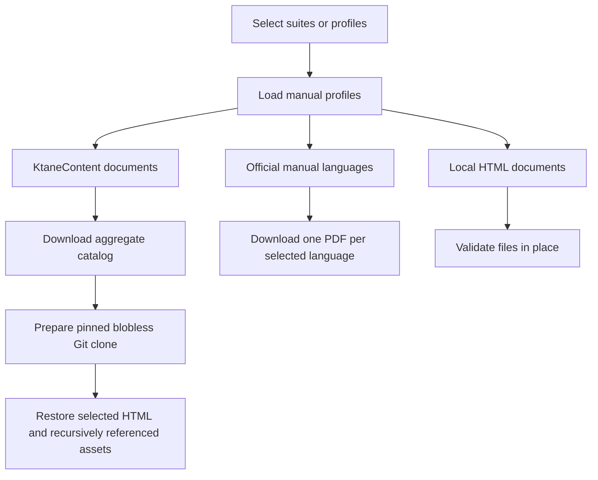
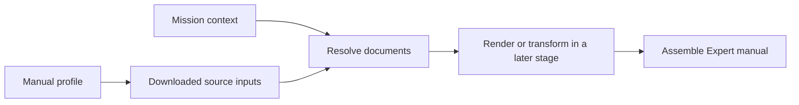

# Manuals

Manual profiles describe the documents required by a suite. The manual commands download their
source files and compile cached handbook artifacts explicitly.

!!! info "Current scope"
    `gptnt manual compile` builds handbook artifacts for review or later processing. `gptnt run`
    does not consume them yet. Runs continue to use the legacy manual until the manual integration
    work is complete.

## Concepts

A **manual profile** lists the modules, widgets, appendices, and local documents that belong in a
manual. A suite selects one profile through Hydra.

The **source configuration** in `configs/manual/sources.toml` identifies the remote inputs available
to every profile. It contains a pinned KtaneContent Git commit, the aggregate KtaneContent catalog
URL, the configured frontmatter, and the version, URL, and module page ranges for every configured
official manual language.

The **manual cache** under `output/manual_cache/` contains downloaded remote inputs, the aggregate
catalog, the pinned Manual Merger checkout, and compiled artifacts. Local documents remain at their
configured paths after validation. The compiler's 256-pixel Keypad symbols are committed with GPTNT.

Two kinds of seeds are part of a mission:

- A **mission seed** is the existing seed used while generating a bomb mission.
- A **rule seed** is `KtaneMissionSpec.rule_seed`. The default value `1` uses the default module
  rules. Values greater than `1` select rules through the Rule Seed Modifier and therefore require
  matching generated manual pages.

The game receives both values separately. Starting a mission with a rule seed other than `1`
requires the Rule Seed Modifier mod to be installed.

## Current download workflow



!!! important "Runs do not prepare manual content."
    `gptnt run` does not download or compile manuals. Run `gptnt manual compile` to download missing
    sources and build handbook artifacts, or run `gptnt manual download` to populate only the source
    cache.


## Manual profiles

Profiles are YAML files under `configs/manual/`. Each profile contains:

- `include_frontmatter`, which records whether the assembled manual should include frontmatter.
- `documents`, an ordered, nonempty list of source documents.

Document order is part of the profile. Resolution preserves that order. When frontmatter is enabled,
its configured source documents appear first in their configured order.

### Document sources

| Source | Profile fields | Download behavior | Resolution behavior |
| --- | --- | --- | --- |
| KtaneContent module | `source`, `id`, `language`, optional `document` | Resolve the HTML filename, then cache its metadata and recursively referenced repository assets | Select the HTML and module metadata from the pinned repository revision |
| KtaneContent appendix | `source`, `language`, `document` | Cache the explicitly named HTML file and its referenced assets | Select the named appendix in profile order |
| Official manual | `source`, `id`, `language` | Download one complete PDF for the language | Select the configured one-based inclusive page range for the module ID |
| Local document | `source`, `path`, `language`, optional `id` | Check that the HTML file exists; do not copy it into the cache | Select the HTML and include each referenced local file in its source identity |

An English KtaneContent module can omit `document`; the aggregate catalog maps its `id` to the
default HTML filename. A translated KtaneContent module must provide `document` because translated
filenames cannot be inferred from the English catalog title.

Repository document names must be bare `.html` filenames. Local document paths may contain
directories. Relative local paths are resolved from the GPTNT repository root.

### Profile examples

=== "KtaneContent and local HTML"

    This profile selects one English KtaneContent module, one appendix, and one local document:

    ```yaml
    include_frontmatter: true

    documents:
      - source: ktanecontent
        id: Wires
        language: en

      - source: ktanecontent
        language: en
        document: Appendix SQUARE.html

      - source: local
        id: CustomModule
        language: en
        path: manuals/custom-module.html
    ```

=== "Official PDF"

    An official-manual profile identifies modules individually, but the download stage fetches the
    language PDF once for all modules in that language. We do this because future games, if they want, can combine different components into a single manual for models.

    ```yaml
    include_frontmatter: false

    documents:
      - source: official
        id: Wires
        language: fr

      - source: official
        id: BigButton
        language: fr
    ```

The shipped profiles are available in `configs/manual/`, including `vanilla.yaml`,
`vanilla_with_needy.yaml`, and `vanilla_fr.yaml`.

### Configure frontmatter and official pages

`include_frontmatter: true` uses the ordered `frontmatter` entries in `configs/manual/sources.toml`.
The shipped source configuration selects pages 1–4 of the English official manual. Set
`include_frontmatter: false` when a profile should start with its first document instead. If
frontmatter is enabled but no frontmatter source is configured, resolution stops and names the
missing frontmatter configuration.

The configured official PDFs currently share the same 23-page layout, verified across all 27
languages. Each language still owns a `pages` table under `official_manual.<language>` so a later
translation can use a different layout. When selecting another official manual version, verify and
update that language's module IDs and inclusive `first` and `last` pages. A profile entry cannot use
an official module until that language's source owns its page range. The resolver reports the
profile index, language, and missing module map.

### Assign a profile to a suite

Select the profile in the suite's Hydra defaults and retain the `ManualProfile` target under
`suite.manual_profile`:

```yaml
defaults:
  - /manual@suite.manual_profile: vanilla

suite:
  manual_profile:
    _target_: gptnt.ktane.manuals.profile.ManualProfile
```

Changing the defaults entry from `vanilla` to another profile name selects the corresponding YAML
file under `configs/manual/`. Suite freezing stores that profile in `suites.lock`, and experiment
generation copies the frozen profile into each generated spec.

## Download and cache source assets

=== "Every configured suite"

    Download the assets required by every configured suite:

    ```bash
    gptnt manual download
    ```

=== "Selected suites"

    Repeat `--suite` to select one or more suites. Repeated suite names and profiles shared by
    several suites are downloaded once:

    ```bash
    gptnt manual download --suite single-pairwise-sync --suite multi-self-sync
    ```

=== "Every manual profile"

    Use `--all-profiles` to include profiles not referenced by any suite:

    ```bash
    gptnt manual download --all-profiles
    ```

    `--all-profiles` and `--suite` cannot be combined.

### What is downloaded

The command uses the aggregate catalog at `https://ktane.timwi.de/json/raw` to map KtaneContent
module IDs to English HTML filenames. It validates the catalog structure, prepares a blobless clone
at the configured Git commit, and materializes only the selected HTML files and the images,
stylesheets, fonts, scripts, frames, and other repository files they reference recursively.

For official documents, the command downloads one PDF for each language present in the selected
profiles. `configs/manual/sources.toml` contains all 27 official languages published by
`bombmanual.com`, but unselected languages are not downloaded. Configured frontmatter can add a
language when at least one selected profile enables it.

Local documents are validated in their configured locations. They are not copied into
`output/manual_cache/` and do not contribute to downloaded or cached file counts.

### Cache behavior

Existing catalog, KtaneContent, and official-manual files are reused based on their presence in the
cache. The downloader does not inspect an existing PDF or compare remote content with a checksum.

The KtaneContent Git commit is pinned. Changing the commit creates a separate repository cache
directory.

!!! warning "Catalog and PDF contents are not pinned"
    The catalog and official PDFs are not checksum-pinned. An official manual's configured
    `version` selects its cache directory; it does not verify the downloaded payload.

    To fetch a changed catalog or official PDF at the same configured URL and version, delete the
    corresponding cache entry and run the command again. Inspect refreshed upstream content before
    using it in a benchmark.


??? question "How do I prepare an offline machine?"
    Run the compile command on a connected machine, then copy `output/manual_cache/` to the same
    path on the offline machine. Copy the complete directory so the downloaded inputs, compiler
    sources, and validated compiled artifacts remain together.

## Compile handbook artifacts

Install the Python dependencies and Playwright-managed Chromium before compiling:

```bash
mise run sync
```

`mise run sync` runs `uv run playwright install chromium` after dependency installation. If the
matching browser build is absent, the compile command reports that exact installation action.

The compile command uses the same profile selection rules as the download command:

```bash
gptnt manual compile
gptnt manual compile --suite single-pairwise-sync --suite multi-self-sync
gptnt manual compile --all-profiles
```

With no flags, the command selects profiles used by every configured suite. Repeated `--suite`
options narrow the selection. `--all-profiles` selects every configured profile and cannot be
combined with `--suite`. Profiles shared by several suites are compiled once.

Compilation first downloads missing source inputs, then resolves each profile for default rule seed
`1`. The compiler runs the pinned KtaneContent Manual Merger with Playwright-managed Chromium over
loopback. It executes the manual JavaScript, waits for fonts and images, substitutes the committed
256-pixel Keypad symbols, prints HTML pages, and imports configured official PDF page ranges with
PyMuPDF. The command prints the artifact directory for each distinct profile.

Each directory under `output/manual_cache/artifacts/` is addressed by its ordered input and renderer
identity. It contains `handbook.pdf`, one UTF-8 text file and PNG for each page, and `manifest.json`.
A complete artifact is reused. An incomplete artifact is rebuilt. Delete an artifact directory to
force a rebuild after inspecting or changing upstream cache contents.

Compilation is an explicit preparation step. `gptnt run` does not invoke this command or read these
artifacts yet.


## Resolve compilation inputs

Manual-building code resolves inputs in this order:



The requested language and every configured document language must match. Mixed-language profiles
stop at the first incompatible profile entry. The current resolver accepts only default rule seed
`1`; any other value stops before source files are rendered. KtaneContent module metadata still
records upstream rule-seed support so a later transformation stage can define additional policy.

Resolution also checks that every input prepared by the download step is present. An absent
KtaneContent HTML or metadata file, official PDF, official page map, local HTML file, or referenced
local dependency is reported with the frontmatter or profile index that selected it. Run
`gptnt manual download` when a configured remote input is missing. Correct the profile or source
configuration when the named document, language, page map, or local dependency is invalid.
