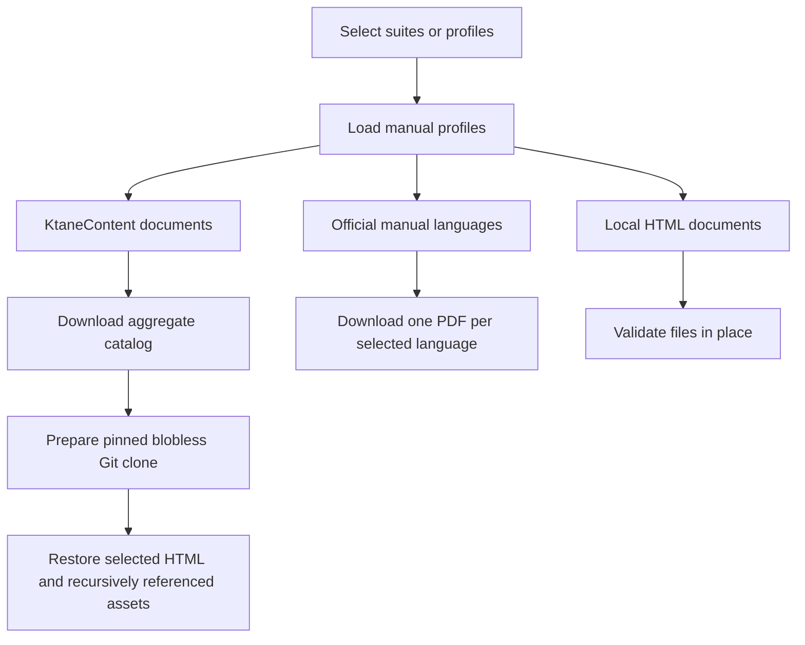
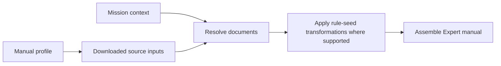

# Manuals

Manual profiles describe the documents required by a suite. The manual download command
prepares the source files for those profiles before a run.

!!! info "Current scope"
    `gptnt manual download` selects profiles, validates local documents, and caches remote source
    files. Resolving those sources into pages, applying Rule Seed Modifier rules, and assembling an
    Expert manual are planned stages. The download command does not perform those stages yet.

## Concepts

A **manual profile** lists the modules, widgets, appendices, and local documents that belong in a
manual. A suite selects one profile through Hydra.

The **source configuration** in `configs/manual/sources.toml` identifies the remote inputs available
to every profile. It contains a pinned KtaneContent Git commit, the aggregate KtaneContent catalog
URL, and the version and URL of each official manual language.

The **manual cache** under `output/manual_cache/` contains downloaded remote inputs and the
aggregate catalog. Local documents remain at their configured paths after validation.

Two kinds of seeds are part of a mission:

- A **mission seed** is the existing seed used while generating a bomb mission.
- A **rule seed** is `KtaneMissionSpec.rule_seed`. The default value `1` uses the default module
  rules. Values greater than `1` select rules through the Rule Seed Modifier and therefore require
  matching generated manual pages.

The game receives both values separately. Starting a mission with a rule seed other than `1`
requires the Rule Seed Modifier mod to be installed.

## Current download workflow



!!! important "You need to run the command manually."
    We do not automatically download/cache the manual content (yet). Therefore you must run the download command to populate the cache.


## Manual profiles

Profiles are YAML files under `configs/manual/`. Each profile contains:

- `include_frontmatter`, which records whether the assembled manual should include frontmatter.
- `documents`, an ordered, nonempty list of source documents.

Document order is part of the profile. The later resolver and assembler must preserve it unless a
document type defines a more specific ordering rule.

### Document sources

| Source | Profile fields | Current download behavior | Planned resolution behavior |
| --- | --- | --- | --- |
| KtaneContent module | `source`, `id`, `language`, optional `document` | Resolve the HTML filename, then cache it and every recursively referenced repository asset | Load module metadata and select or generate the page for the requested rules |
| KtaneContent appendix | `source`, `language`, `document` | Cache the explicitly named HTML file and its referenced assets | Include the static appendix page |
| Official manual | `source`, `id`, `language` | Download one complete PDF for the language | Locate the page or pages belonging to the module ID |
| Local document | `source`, `path`, `language`, optional `id` | Check that the HTML file exists; do not copy it into the cache | Include the supplied HTML, subject to an explicit future rule-seed policy |

An English KtaneContent module can omit `document`; the aggregate catalog maps its `id` to the
default HTML filename. A translated KtaneContent module must provide `document` because translated
filenames cannot be inferred from the English catalog title.

Repository document names must be bare `.html` filenames. Local document paths may contain
directories. Relative local paths are resolved from the GPTNT repository root.

### Profile examples

=== "KtaneContent and local HTML"

    This profile selects one English KtaneContent module, one appendix, and one local document:

    ```yaml
    include_frontmatter: true

    documents:
      - source: ktanecontent
        id: Wires
        language: en

      - source: ktanecontent
        language: en
        document: Appendix SQUARE.html

      - source: local
        id: CustomModule
        language: en
        path: manuals/custom-module.html
    ```

=== "Official PDF"

    An official-manual profile identifies modules individually, but the download stage fetches the
    language PDF once for all modules in that language. We do this because future games, if they want, can combine different components into a single manual for models.

    ```yaml
    include_frontmatter: false

    documents:
      - source: official
        id: Wires
        language: fr

      - source: official
        id: BigButton
        language: fr
    ```

The shipped profiles are available in `configs/manual/`, including `vanilla.yaml`,
`vanilla_with_needy.yaml`, and `vanilla_fr.yaml`.

### Assign a profile to a suite

Select the profile in the suite's Hydra defaults and retain the `ManualProfile` target under
`suite.manual_profile`:

```yaml
defaults:
  - /manual@suite.manual_profile: vanilla

suite:
  manual_profile:
    _target_: gptnt.ktane.manuals.profile.ManualProfile
```

Changing the defaults entry from `vanilla` to another profile name selects the corresponding YAML
file under `configs/manual/`.

## Download and cache source assets

=== "Every configured suite"

    Download the assets required by every configured suite:

    ```bash
    gptnt manual download
    ```

=== "Selected suites"

    Repeat `--suite` to select one or more suites. Repeated suite names and profiles shared by
    several suites are downloaded once:

    ```bash
    gptnt manual download --suite single-pairwise-sync --suite multi-self-sync
    ```

=== "Every manual profile"

    Use `--all-profiles` to include profiles not referenced by any suite:

    ```bash
    gptnt manual download --all-profiles
    ```

    `--all-profiles` and `--suite` cannot be combined.

### What is downloaded

The command uses the aggregate catalog at `https://ktane.timwi.de/json/raw` to map KtaneContent
module IDs to English HTML filenames. It validates the catalog structure, prepares a blobless clone
at the configured Git commit, and materializes only the selected HTML files and the images,
stylesheets, fonts, scripts, frames, and other repository files they reference recursively.

For official documents, the command downloads one PDF for each language present in the selected
profiles. `configs/manual/sources.toml` contains all 27 official languages published by
`bombmanual.com`, but unselected languages are not downloaded.

Local documents are validated in their configured locations. They are not copied into
`output/manual_cache/` and do not contribute to downloaded or cached file counts.

### Cache behavior

Existing catalog, KtaneContent, and official-manual files are reused based on their presence in the
cache. The downloader does not inspect an existing PDF or compare remote content with a checksum.

The KtaneContent Git commit is pinned. Changing the commit creates a separate repository cache
directory.

!!! warning "Catalog and PDF contents are not pinned"
    The catalog and official PDFs are not checksum-pinned. An official manual's configured
    `version` selects its cache directory; it does not verify the downloaded payload.

    To fetch a changed catalog or official PDF at the same configured URL and version, delete the
    corresponding cache entry and run the command again. Inspect refreshed upstream content before
    using it in a benchmark.


??? question "How do I prepare an offline machine?"
    Run the download command on a connected machine, then copy `output/manual_cache/` to the same
    path on the offline machine.


## Planned manual resolution for rule seeds

The later manual-building pipeline should operate in this order:



The mission context provides the game language and `rule_seed`. The resolver should produce
concrete pages with the metadata needed for ordering, rendering, and provenance. KtaneContent
module metadata will be needed for fields such as module name, sort key, origin, and rule-seed
capability. The aggregate catalog currently downloaded is sufficient for filename lookup but not
for all of that future resolution work.

Rule-seed eligibility belongs to resolved document metadata, not to the manual profile. A profile
describes which logical documents a suite uses; the mission context determines which rule variant
must be rendered.

### Planned compatibility policy

The following table describes intended policy, not behavior currently enforced by the downloader:

!!! warning "Rule seed values above 1 require generated pages"
    Official PDFs contain only default rules. A mission using a non-default `rule_seed` must use
    rule-seed-capable KtaneContent pages once the resolver and generator are implemented.

| Rules | Game language | Manual inputs | Planned result |
| --- | --- | --- | --- |
| Default | English | Explicitly selected supported language and source | Resolve the selected profile |
| Default | Non-English | Manual language matches the game language | Resolve the selected profile |
| Default | Non-English | Manual language differs from the game language | Reject the combination |
| Non-default rule seed | English | Rule-seed-capable KtaneContent pages | Generate the seeded pages |
| Non-default rule seed | Any | Official PDF | Reject because a static PDF cannot represent changed rules |
| Non-default rule seed | Non-English | Any current source | Reject until the game, mod, and manual sources support the combination |

Appendices and local documents need an explicit policy before rule-seed generation is implemented.
A static appendix may be valid for every rule seed, while a local module page may describe rules
that must change. The resolver should not infer this distinction from the source type alone.

<!--
### Future generated-manual caching

Downloaded source inputs and generated manuals should use separate caches. A generated-manual cache
key will need to include every input that can change its content, including:

- Manual profile identity
- KtaneContent commit and other source versions
- Rule seed
- Game and document languages
- Selected modules and appendices
- Manual generator or renderer version

This separation allows several rule seeds to reuse the same downloaded HTML, assets, and metadata
without confusing a generated manual with its upstream inputs. -->
