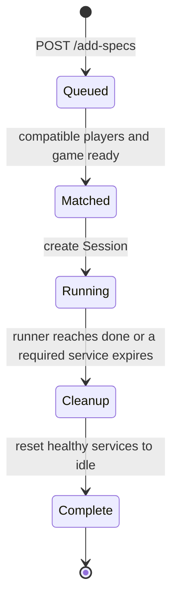

# Experiment manager

The experiment manager combines an HTTP queue, the service registry, matchmaking, and one
`Session` per running experiment. It does not start game or player processes; the run orchestrator
starts those processes before submitting specifications.

!!! info "Current implementation"
    The API routes and service classes on this page are maintainer contracts. They can change with
    the runtime implementation and are not supported extension points.

## HTTP boundary

| Route | Response or effect |
| ----- | ------------------ |
| `GET /health` | Returns `true` when the FastAPI application is serving requests. |
| `POST /add-specs` | Accepts `{"specs": [ExperimentSpec, ...]}` and adds new attempts to the queue. |
| `GET /active` | Returns `running` and `queued` attempt-name lists. |

Posting the same attempt name and equal specification again is idempotent. Posting different
specification content under an existing attempt name returns HTTP 409. The comparison includes
queued specifications and running sessions.

## Lifespan and matchmaking

`ExperimentManager` extends `ObservableServiceRegistry`. Its lifespan starts Redis, the heartbeat
watcher, a matchmaking loop, and a metrics loop. Matchmaking runs once per second.

For each cycle, the manager:

1. Reads ready players and games from the registry.
2. Finds player combinations that satisfy queued specifications.
3. Removes a selected specification from the queue.
4. Marks its game and players `in_experiment`.
5. Creates a session and starts it in the manager task group.

At least one game is required. Pairwise specifications require the configured Defuser and Expert,
while a solo specification requires only its configured Defuser.

## Session and runner

A `Session` stores the specification, selected service manifests, Redis connections, and one
generated experiment UUID. It creates an `ExperimentInstance` by adding game and player UUIDs,
resolved capabilities, and the session ID to the specification.

The session name is `<attempt_name>--<experiment_uuid>`. Communication style selects
`SyncExperimentRunner` or `AsyncExperimentRunner`.

When a running service expires, the manager marks it not ready and asks its session to stop. Session
cleanup returns surviving service manifests to `idle`. Finished sessions are removed from the
active list and update completed or failed metrics.

## Evidence in tests

- `test_repeated_spec_is_idempotent` covers repeated equal input.
- `test_conflicting_spec_for_attempt_is_rejected` covers the HTTP 409 condition.
- Matchmaking tests cover solo, named-player, and two-player selection.
- Integration smoke tests cover registration, solved, strikeout, timeout, partial, solo,
  asynchronous, and player-crash paths.

[Service registry](service-registry.md)
[Game service](game-service.md)
[Player service](player-service.md)
