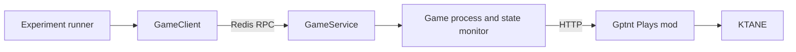

# Game service

One game service owns one KTANE process, the HTTP client for the GPTNT game mod, a state monitor,
and Redis RPC handlers. The experiment runner uses `GameClient`; the client does not call KTANE
HTTP endpoints directly.

!!! info "Current implementation"
    `GameService`, `GameClient`, and the underlying KTANE clients are runtime implementation. The
    action and mission models they consume have separate supported-interface decisions.

## Service lifecycle

The game entry point starts a `GameServiceContext`, which launches KTANE and monitors game state.
The service heartbeat becomes ready after its Redis and game resources start. The registry makes a
game available for matchmaking only while it is ready, idle, and at `GameState.main_menu`.

`configure_game` accepts a materialised mission plus the session ID. It requires the main-menu
state and starts the mission through the mod. The service waits for the initial light transition,
then pauses game time before the first experiment step.

## Redis commands

All commands use `game:<game_uuid>:commands:<command>`.

| Purpose | Commands |
| ------- | -------- |
| Configure and reset | `configure_game`, `go_to_main_menu`, `stop_game` |
| Read state | `get_game_state`, `get_bomb_state`, `get_frames` |
| Apply input | `send_action` |
| Control time | `pause_game`, `unpause_game`, `advance_game_time`, `set_game_speed` |

`get_bomb_state` uses a 10-second client timeout. `get_frames` uses a 60-second timeout. Short game
control operations can use the 5-second game-request timeout; other RPC calls inherit the
600-second default.

## Error boundaries

The service translates failed HTTP operations into HTTP exceptions carried through the Redis
response decoder. It preserves the mod response in the `X-Reason` header where available.

An action received after the game enters its transition or post-game state is treated as an
expected race by `GameClient`. Other action errors propagate. A detonated bomb stops a Defuser
observation before another model pass.

File layout, saved settings, mod loading, display access, and the game process live below this
service boundary. Diagnose those conditions in
[game and display troubleshooting](../../troubleshooting/game-and-displays.md).
