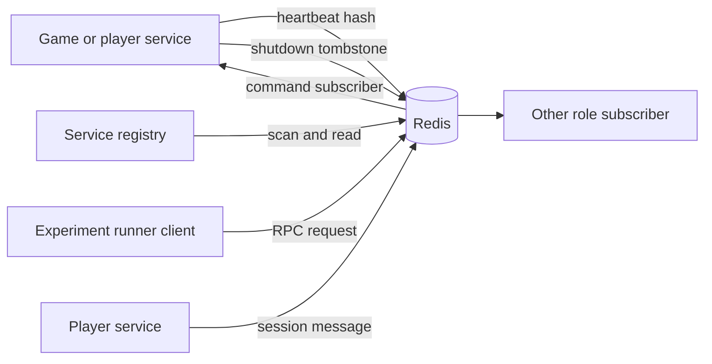

# Heartbeats and RPC

Redis carries service liveness, game and player request-response calls, and player-to-player
messages. Each contract uses a separate key or channel pattern.

!!! info "Current implementation"
    Maintainers can diagnose the runtime by inspecting these keys, channels, and payloads. The
    timeout table defines how long clients wait. None of these contracts is a public transport
    protocol for external services.



## Heartbeat and tombstone keys

| Key | Writer | Reader | Lifetime |
| --- | ------ | ------ | -------- |
| `heartbeat:<service_name>:<uuid>` | Game or player heartbeat broadcaster | Service registry | Refreshed every 3 seconds; expires after 10 seconds |
| `tombstone:<service_name>:<uuid>` | Broadcaster during graceful shutdown | Registry expiry diagnostics | Expires after 120 seconds |

A heartbeat includes service UUID and name, timestamp, readiness, monotonically increasing
sequence, uptime, PID, and hostname. Player and game heartbeat variants add their service state;
players also report capabilities.

Graceful shutdown changes readiness to `not_ready`, writes a final heartbeat, then writes a
tombstone. The tombstone includes the final readiness, failure reason, heartbeat count, and uptime.

## Expiry diagnosis

`ServiceExpiredContext` records:

- whether a tombstone exists;
- whether the heartbeat key still exists and its remaining TTL;
- any remaining hash fields;
- the last sequence, uptime, PID, and hostname seen by the registry.

| Failure category | Condition |
| ---------------- | --------- |
| `graceful_shutdown` | A tombstone records normal service shutdown. |
| `partial_hash` | No tombstone exists, but the heartbeat key and some fields remain. |
| `unexpected_disappearance` | No tombstone or usable remaining heartbeat fields exist. |
| `never_connected` | Declared enum value that the current context property does not return. |

## Generated heartbeat contracts

These generated models expose fields used by the current service implementation. They do not
define a supported transport or Python extension interface.

::: gptnt.interactive.services.heartbeat.base.BaseHeartbeat
    options:
      show_root_heading: true
      members:
        - timestamp
        - ready_state
        - is_idle

::: gptnt.interactive.services.heartbeat.player.PlayerHeartbeat
    options:
      show_root_heading: true
      members:
        - capabilities
        - is_idle

::: gptnt.interactive.services.heartbeat.tombstone.Tombstone
    options:
      show_root_heading: true
      members:
        - uptime_seconds

::: gptnt.interactive.services.heartbeat.tombstone.ServiceExpiredContext
    options:
      show_root_heading: true
      members:
        - tombstone
        - heartbeat_key_ttl
        - remaining_heartbeat_fields
        - last_heartbeat_seq
        - failure_category

## RPC channels

| Channel | Client | Service |
| ------- | ------ | ------- |
| `game:<uuid>:commands:<command>` | `GameClient` | `GameService` |
| `player:<uuid>:commands:<command>` | `PlayerClient` | `PlayerService` |

`BaseRPCClient` sends a payload through FastStream's request-response operation and decodes the
reply. Service handlers register one subscriber per command. The response decoder reconstructs
transported exceptions where the service returns one.

!!! warning "A timeout does not identify one cause"
    The default Redis RPC timeout is 600 seconds. Individual bomb-state, observation, and game
    control calls can use shorter limits. A timeout can mean the subscriber is absent, the service
    expired, Redis is unreachable, or the operation itself exceeded its limit. Check heartbeats,
    the registry, and the corresponding process log before changing a timeout.

## Player messages

Player communication uses:

```text title="Message channel"
session:<session_id>:player:<role>:messages
```

A player publishes to the other role's channel. `IncomingMessageHandler` subscribes when the
player is configured for the session and stores received messages. It supplies the messages to the
next forward pass. These messages are asynchronous events rather than RPC commands.

[Service registry](service-registry.md)
[Troubleshoot Redis and services](../../troubleshooting/redis-and-runtime-services.md)
