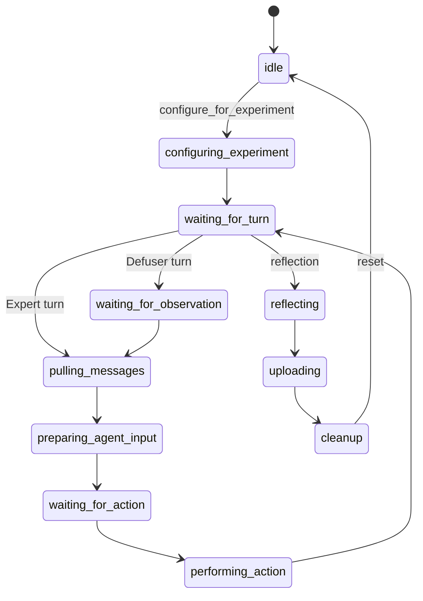

# Player service

One player service assembles a configured player and exposes it through Redis RPC. It owns prompt
and manual input, incoming messages, observation processing, the model call, action dispatch,
feedback, reflection, and one player record.

!!! info "Current implementation"
    The service classes and command payloads describe runtime maintenance. Custom players should use
    the selected player, action, observation, and processor interfaces rather than importing the
    service implementation.

## Configuration boundary

`configure_for_experiment` receives the selected `PlayerProtocol`, `ExperimentInstance`, and
`Provenance`. The service configures its recorder before model work begins. It loads the prepared
manual artefact only when the protocol includes a manual.

The service then creates a conversation, input builder, action predictor, and action dispatcher for
the experiment. A Defuser also binds its `GameClient` to the selected game UUID. The incoming
message subscriber is scoped to the session and role.

## Forward-pass boundary

A forward pass must start from `waiting_for_turn`:

1. The Defuser requests bomb state and frames. An Expert has no game observation.
2. The service pulls messages addressed to the player's role.
3. `AgentInputBuilder` prepares the model input from messages, observations, and protocol.
4. `ActionPredictor` sends the request to the configured model.
5. The action dispatcher applies an action or sends a message according to the role and protocol.
6. Optional feedback handlers run.
7. The recorder writes the step and the conversation retains the new messages.
8. The service returns to `waiting_for_turn`.

## Redis commands

All commands use `player:<player_uuid>:commands:<command>`.

| Command | Effect |
| ------- | ------ |
| `configure_for_experiment` | Bind protocol, instance, provenance, manual, recorder, and conversation. |
| `forward_pass` | Perform one observation-to-action or message turn. |
| `send_feedback` | Add feedback to the incoming-message handler. |
| `reflection` | Request the configured reflection operation. |
| `get_state` | Return the current `PlayerState`. |
| `stop` | Finalise the experiment, including final bomb and crash state where available. |
| `reset` | Release experiment-specific state for another match. |

Player-to-player messages use `session:<session_id>:player:<role>:messages`. They do not share the
RPC command channel.

The [player interfaces](../python/player-interfaces.md) define configuration and prediction
objects. [Actions and observations](../python/actions-and-observations.md) and
[processors](../python/processors.md) define the supported data and image-processing surfaces.

## Recording boundary

The recorder writes `ExperimentStep` data during the experiment and a `RecordFooter` when the
player stops. The footer contains the experiment instance, final bomb state, provenance, crash
state, and role. A hard player crash can therefore mark the experiment invalid even when other
services remain reachable.
