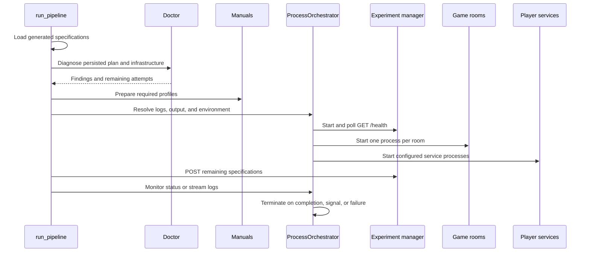

# Run orchestration

The `run` pipeline defines the command-to-process boundary. It validates persisted specifications
and prepares shared inputs. It then starts the process cluster and sends work. The monitor tracks
whether each process exits and terminates every process the pipeline started.

!!! info "Current implementation"
    `gptnt.cli.run._pipeline` is private. `ProcessOrchestrator` and the spawn functions are selected
    here to explain maintenance paths, not to define an external orchestration API.

## Pipeline stages

| Stage | Contract |
| ----- | -------- |
| Load | Read every `*.json` recursively from `output/experiment_specs/<manifest-stem>/`. Empty input stops before doctor or spawn. |
| Gate | Run doctor against the files on disk. Protected-benchmark and roster failures are not bypassed by `--force`. |
| Resume | Use the manifest completion source to select unfinished attempts. No remaining work exits without spawn. |
| Manuals | [Prepare](../../manuals.md) each distinct profile required by remaining manual-bearing players. Failure stops before spawn. |
| Directories | Resolve one recorder output and one `output/logs/run_<output-name>/` directory, then pass the pinned output to recorder children. |
| Spawn | Start the experiment manager, rooms, and player services in that order. |
| Submit | Post the remaining specifications in-process. Failed submission terminates the cluster. |
| Monitor | Render a process table or stream prefixed logs with `-i`. Any non-zero child exit terminates the cluster. |

## Process startup

`ProcessOrchestrator.spawn` runs each service with `uv run python -u -m`. Standard output and
standard error share one process log. Interactive mode pipes that stream through the CLI while
writing the same log file.

The experiment manager starts first. The orchestrator polls its configured `/health` URL every
0.5 seconds for up to 60 seconds. It checks the child exit status between requests. Game rooms then
start two seconds apart. Configured player processes start one second apart.

Room display placement is round-robin when the run manifest provides `displays`. Otherwise each
room inherits the ambient `DISPLAY`. Player children receive the pinned recorder directory and the
prepared manual-artifact mapping.

## Tracked process state

| `ProcessStatus` | Meaning |
| --------------- | ------- |
| `RUNNING` | The process has no exit code. |
| `DONE` | The process exited with code 0. |
| `FAILED` | The process exited with a non-zero code. |
| `KILLED` | The orchestrator forcibly stopped a process after its grace period. |

`TrackedProcess` retains the name, process handle, log path, log file, status, and exit code.

## Termination

The signal handler marks shutdown and lets the current startup or monitor path terminate all
running children. `terminate_all` sends a termination signal, waits up to 35 seconds, then forcibly
stops remaining processes. A child failure uses the same terminate-and-error path.

[CLI run contract](../cli/run.md){ .md-button }
[Experiment manager](experiment-manager.md){ .md-button }
