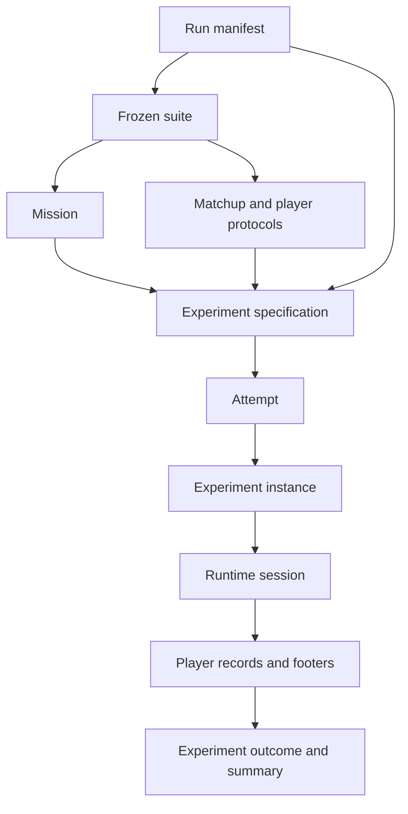

# Experiment hierarchy

GPTNT separates authored run choices, frozen benchmark definitions, generated work, runtime
identity, and recorded output. The separation lets generation remain inspectable while runtime
services add identities and results only when an attempt executes.



## Authored run choices

A **run manifest** selects one or more suites, a player roster, room capacity, optional display
placement, completion source, observability preset, anchors, and an optional attempt-count
override. [Create a run manifest](../running/create-run-manifest.md) describes that choice point.

A **suite** defines what is measured. It combines a mission set, matchup rules, player protocols,
modalities, a revision, and a manual profile. Published suites are frozen in `suites.lock`; their
suite digest identifies the frozen configuration and mission snapshot.

The [manuals and rule seeds](manuals-and-rule-seeds.md) concept explains how the selected profile
and the mission's rule-seed value contribute to benchmark identity.

A **mission** describes one KTANE bomb: modules, seed, rule seed, time limit, strike count, widgets,
and related game parameters. A mission set groups materialised missions used by a suite.

## Generated work

`gptnt generate` combines the manifest roster with each selected suite. It writes an
`ExperimentSpec` for every mission, player pairing, and attempt.

An **experiment specification** contains the mission, suite name, suite revision, suite digest,
manual profile, player protocols, configured player names, and attempt number. It does not contain
runtime service UUIDs, resolved capabilities, a start time, or a result.

An **attempt** is one numbered repetition represented by one specification. GPTNT writes each
specification to `<attempt_name>.json`. The experiment fingerprint excludes the attempt number and
player names because those values do not change the mission, frozen suite, or protocols being
measured.

!!! example "One quickstart path"
    `runs/quickstart.yaml` selects `single-pairwise-sync`. Generation combines the suite's missions
    and protocols with `test-defuser` and `test-expert`, then writes the resulting attempts under
    `output/experiment_specs/quickstart/`.

## Runtime identity

The experiment manager selects a ready game and the required ready player services. A `Session`
adds their UUIDs and reported capabilities to the specification to create an
`ExperimentInstance`. The instance also records a session ID and start time.

The session name has this form:

```text title="Attempt name"
<attempt_name>--<experiment_uuid>
```

A **session** is the runtime controller for one instance. It selects the synchronous or
asynchronous experiment runner from the specification's communication style. An attempt describes
requested work. A session describes one execution of that work.

## Records and outcomes

Each participating player writes an `ExperimentStep` sequence and a `RecordFooter`. The footer
contains the experiment instance, final bomb state, provenance, crash information, and player
role. These player records use Parquet format version 3.

An `ExperimentOutcome` declares the terminal outcome, remaining time, strikes, and solved modules.
An `ExperimentSummary` combines the instance, provenance, outcome, and crash state for DuckDB.

`ExperimentDescriptor` is not a v2 type. Use `ExperimentSpec` for generated work and
`ExperimentInstance` for its runtime form.

[Understand the runtime services](runtime-services.md)
[Run the quickstart](../start-here/run-quickstart.md)
