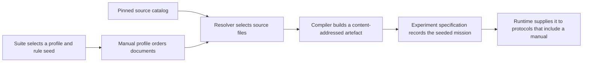

# Manuals and rule seeds

A manual profile describes a reproducible handbook. The suite selects the profile and
`manual_rule_seed`. Generation copies that seed into every mission specification for the suite.
GPTNT checks the profile-and-seed pair before it gives a manual to a player.

## From a profile to a player prompt

The profile controls document order and whether frontmatter is included. The source catalog pins
the KtaneContent repository, official manuals, page ranges, and compiler inputs. Local documents
remain at their configured paths, but their content and local dependencies contribute to the
artefact identity.

Resolution checks that all effective documents use one language. Compilation produces a handbook,
numbered page text and images, and a manifest of inputs and file hashes. Its cache key is derived
from those inputs. GPTNT validates the cached files before reuse, so the directory name alone is
not proof that an artefact is usable.

## The suite selects the manual requirement

Specification generation records the suite-selected rule seed in each mission specification. The
manual requirement is the manual profile plus that seed. `manual compile` creates the artefact for
each selected suite requirement. Doctor loads and validates the matching artefact before a run.

Protocols decide whether a player receives the handbook through `include_manual`. The same player
configuration can therefore act in a role with a manual and in another role without one. Manual
selection belongs to the suite and protocol, not to the model provider.

## Rule seeds mark the rules boundary

A mission rule seed is part of benchmark identity. `manual_rule_seed` defaults to `1`. For a
non-default seed, GPTNT applies the seed only to KtaneContent modules whose pinned metadata declares
`RuleSeedSupport: Supported`. Widgets, appendices, official pages, and local documents remain
unchanged. A profile may contain both kinds of document.

The rule seed identifies the mission's rules. The manual artefact key identifies the compiled
handbook bytes, source inputs, renderer, and rule seed. Both participate in reproducible execution.

Use [Prepare manuals](../run-and-submit/prepare-manuals.md) for the procedure and the
[manual configuration reference](../reference/configuration/manuals.md) for exact fields.
