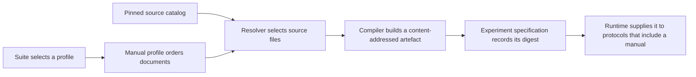

# Manuals and rule seeds

A manual profile describes a reproducible handbook. The suite selects the profile, while each
mission specification includes the rule seed that identifies the rules used for its bomb. GPTNT
checks both before it gives a manual to a player.

## From a profile to a player prompt

The profile controls document order and whether frontmatter is included. The source catalog pins
the KtaneContent repository, official manuals, page ranges, and compiler inputs. Local documents
remain at their configured paths, but their content and local dependencies contribute to the
artefact identity.

Resolution checks that all effective documents use one language. Compilation produces a handbook,
numbered page text and images, and a manifest of inputs and file hashes. Its cache key is derived
from those inputs. GPTNT validates the cached files before reuse, so the directory name alone is
not proof that an artefact is usable.

## The experiment stores the manual identity

Specification generation resolves the selected manual profile and stores the resulting digest in
the experiment specification. At run time, GPTNT prepares the profile again and checks that digest.
This connects the generated experiment to the exact handbook supplied to manual-bearing players.

Protocols decide whether a player receives the handbook through `include_manual`. The same player
configuration can therefore act in a role with a manual and in another role without one. Manual
selection belongs to the suite and protocol, not to the model provider.

## Rule seeds mark the rules boundary

A mission rule seed is part of benchmark identity. GPTNT v2 prepares manuals only for rule seed
`1`. Manual resolution fails when a manual-bearing experiment uses another rule seed.

!!! warning "Current preparation boundary"
    Use rule seed `1` for experiments that include a manual. Do not treat another integer as a way
    to select different manual content. The current resolver does not support it.

The rule seed and manual digest protect different inputs. The rule seed identifies the mission's
rules. The digest identifies the compiled handbook bytes and their provenance. Both belong in a
reproducible specification.

Use [Prepare manuals](../manuals.md) for the procedure and the
[manual configuration reference](../reference/configuration/manuals.md) for exact fields.
