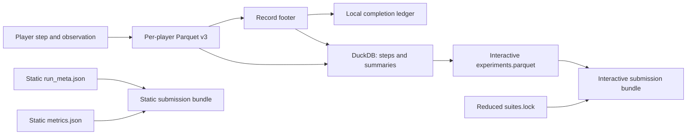

# Results and provenance

GPTNT keeps source records separate from derived analysis and submission artefacts. That boundary
allows completion, collation, and validation to use the same recorded execution facts.

## Player records own the execution detail

Each player service writes one Parquet file for its role in an execution. Step rows hold actions,
model messages, observations, usage, bomb state, parsing errors, and relative dispatch time. The
footer holds the shared `ExperimentInstance`, final bomb state, role, crash state, and provenance.

The recorder writes a sibling `.tmp` file and renames it only after Parquet writing finishes.
Orphaned `.parquet.tmp` files therefore indicate interrupted writes rather than completed records.

## Completion comes from terminal evidence

The local completion ledger groups player-record footers by `attempt_name`. An execution is valid
only when it has no hard crash and its outcome is solved, timeout, or strikeout. A generic
detonation or incomplete state does not count as a valid completed outcome.

The W&B ledger supplies the same status contract for cross-machine aggregation. `local` and `wandb`
can differ in where they read state, but both use the shared terminal-outcome rule to decide which
attempts are safe to skip.

## DuckDB is an analysis projection

`build-db` reads Parquet rows directly into `experiment_step` and derives one
`experiment_summary` row from the grouped footers. The summary combines runtime identity, frozen
suite and mission data, protocols, capabilities, outcome, crash state, and provenance. The
database has no independent provenance or completion authority.

## Static output binds identity before prediction

A dataset-backed static run writes `run_meta.json` before its first prediction. The file binds the
player capabilities, run date, benchmark provenance, requested dataset revision, and resolved
dataset commit. Predictions are per-instance files. `metrics.json` is the task-dependent aggregate.

## Submission reduces rather than replaces

Interactive bundle construction selects summary and usage data from DuckDB and writes
`experiments.parquet`. It does not include the full trajectories. The bundle also contains a reduced
suite lock, which lets validation reconstruct the recorded suite without reading live suite files.
A static bundle copies `metrics.json` and describes it with the stored static metadata.

!!! warning "Keep source Parquet through validation"
    DuckDB and `experiments.parquet` are derived representations. Keep the original player-record
    Parquet until every intended bundle validates, so you can rebuild after a collation, selection,
    or schema problem.

[Inspect results](../run-and-submit/inspect-results.md)
[Player records and outcomes](../reference/files/player-records-and-outcomes.md)
