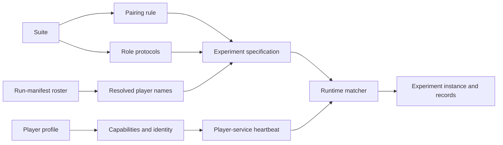

# Roles, protocols, and capabilities

Suites define how participants take part in an experiment. Player profiles define what a running
participant can accept and produce. Generation and runtime join those two boundaries through the
recorded `player_name`.

## Roles determine access

KTANE uses two roles:

| Role | Experiment access |
| ---- | ----------------- |
| Defuser | Receives game observations and can dispatch game actions. The protocol may also provide the manual. |
| Expert | Receives messages and returns messages. The protocol determines whether the manual is included. |

A solo experiment has one Defuser and no Expert, while a player profile is not tied to either
role. Create one profile per configured player and let the suite protocol assign its role for each
experiment.

## Protocols define participation rules

Each `PlayerProtocol` records:

- the `role`;
- `communication_style`, either synchronous turns or asynchronous participation;
- whether the player is alone and whether its prompt includes the manual;
- whether it receives feedback after an action; and
- whether benchmark-specific magic or lottery actions are permitted.

An Expert cannot be marked as playing alone. A solo Defuser cannot have an Expert protocol. A
protocol with more than one player permits message output. A solo protocol does not.

The suite also selects one pairing rule:

| Pairing value | Generated pairings |
| ------------- | ------------------ |
| `pairwise` | Every roster player as Defuser with every roster player as Expert, including self-pairs |
| `with_self` | Each roster player paired with itself |
| `no_expert` | Each roster player as a solo Defuser |
| `with_best_expert` | Each non-anchor roster player as Defuser with the configured Expert anchor |
| `with_best_defuser` | The configured Defuser anchor with each non-anchor roster player as Expert |

The generated specification stores the chosen player names and both protocols. It does not store
provider configuration or running service UUIDs.

## Capabilities describe the configured participant

`PlayerCapabilities` controls model input, output parsing, and recorded participant identity. The
fields include thinking and structured-output modes, image size, image-token cost, observation
retention, location representation, feedback generation, and the model settings selected for
identity.

The runtime matcher currently selects a player service by `capabilities.player_name`. Other
capability fields do not participate in that selection. Once assigned, the complete capabilities
are copied into the experiment instance and records.

!!! warning "Suite modalities are descriptive in v2"
    Suite modalities are included in suite identity, but v2 execution does not enforce them against
    player capabilities. Validate that a selected model accepts the suite's input yourself.

Capabilities also enforce cross-field rules:

- thinking out loud cannot use structured output;
- prompted structured output always includes the schema;
- normalised coordinate output requires a positive scale; and
- absolute coordinate output cannot declare a scale.

The [player configuration reference](../reference/configuration/players.md) gives the exact fields
and generated constraints.

## Identity and fingerprints serve different purposes

`PlayerIdentity` supplies the display name, organisation, model page, and open-source flag used for
submission attribution. It does not control the model call.

The capability fingerprint is a stable digest of the fields that GPTNT treats as the participant's
benchmark configuration. It includes `player_name`, thinking and output modes, observation and
image settings, location settings, feedback generation, and selected model settings. Request
`usage_limits` are recorded but are not included in this fingerprint.

The base Hydra configuration derives `capabilities.model_settings` from the configured Pydantic AI
model settings. Settings that affect model input or generation remain in the digest. Transport,
routing, cache, storage, billing, and response-metadata controls listed by
`fingerprint_model_settings` are omitted.

Changing fields on `PlayerIdentity` changes attribution. Changing a fingerprinted capability
changes the participant grouping used by results and submissions. Neither change alters the suite
revision or suite digest, which identify what was measured.
