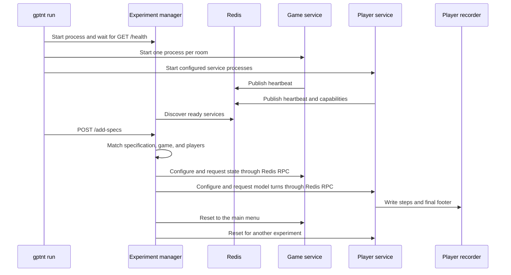

# Runtime services

`gptnt run` assembles a temporary process cluster around pre-generated experiment specifications.
The CLI owns process lifecycle. The experiment manager owns queuing and matchmaking. Game and
player services perform the experiment through Redis.

!!! info "Current implementation"
    These service relationships describe the current GPTNT runtime. They are maintainer reference,
    not supported extension interfaces. Use the selected [Python interface pages](../reference/python/index.md)
    when integrating custom code.

## Process orchestration

The CLI validates the run, including compiled manual artefacts, and filters completed attempts. It
resolves one output directory. `ProcessOrchestrator` starts the experiment manager, game rooms,
and player services. It sends specifications only after the experiment manager responds to
`/health`.

The orchestrator writes one log per process. It monitors exit codes and terminates the cluster
when a child fails, submission fails, the run completes, or the user sends a shutdown signal.

## Experiment manager and registry

The experiment manager stores queued specifications and running sessions. Its service registry
discovers player and game heartbeats in Redis. Matchmaking selects a compatible idle player set
and an idle game at the main menu, then marks those services as in use.

A session runs one experiment instance. It coordinates the selected game and player clients,
watches their state, and returns healthy services to the idle pool during cleanup.

## Game and player services

A game service wraps one KTANE process. It translates Redis RPC commands into operations on the
GPTNT game mod, including game configuration, observations, actions, pause state, and reset.

A player service assembles a configured player. It receives an experiment protocol and runtime
instance, then prepares observations and messages. It performs model passes and returns actions or
messages. It also handles optional feedback and reflection before writing the player record.

## Redis communication and liveness

Redis carries three different contracts:

- RPC requests and responses for game and player commands.
- Player-to-player messages scoped to a session and role.
- Heartbeat hashes and shutdown tombstones used by the registry.

Heartbeats report readiness, service state, sequence, uptime, process ID, and hostname. The
registry stops a running session when one of its required services expires.

## Continue into the implementation

| Operation | Reference page |
| --------- | -------------- |
| Process startup, monitoring, and termination | [Run orchestration](../reference/runtime/run-orchestration.md) |
| Queue, matchmaking, sessions, and runners | [Experiment manager](../reference/runtime/experiment-manager.md) |
| KTANE process and commands | [Game service](../reference/runtime/game-service.md) |
| Model calls, messages, and recording | [Player service](../reference/runtime/player-service.md) |
| Readiness and service state | [Service registry](../reference/runtime/service-registry.md) |
| Liveness, channels, and timeouts | [Heartbeats and RPC](../reference/runtime/heartbeats-and-rpc.md) |
