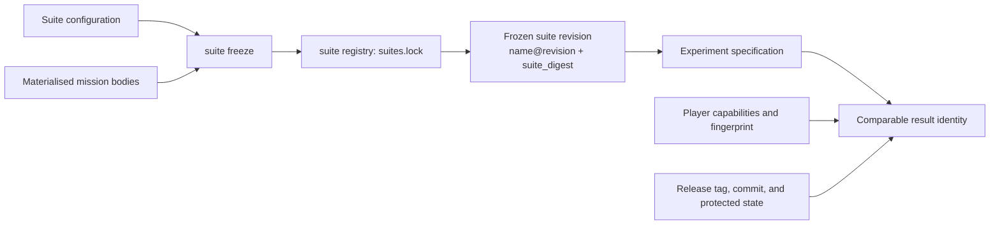

# Suites, revisions, and comparability

A result is comparable only when the inputs that define the measurement agree. The GPTNT package
version alone does not establish that agreement.

## Suite identity

A suite revision is selected by its `name@revision`, such as `multi-self-sync@2`. The revision is
the human-managed boundary for comparable results. Increase it whenever measured content changes.

`suite_digest` identifies the measured content for one materialised suite: mission bodies,
`manual_profile`, `manual_rule_seed`, role protocols, matchup, and modalities. It excludes the
suite name, revision, configuration path, and freeze provenance. The lock version defines both the
TOML layout and this digest recipe.

`gptnt suite freeze` records each frozen suite revision in `configs/suites/suites.lock`. It rejects
measured content whose digest differs at an existing name and revision. Generation reads the frozen
entry rather than the current suite YAML and copies its revision and digest into every
specification.

The suite's `modality` set participates in `suite_digest`. Current v2 execution does not enforce
that set against player capabilities, so successful scheduling does not prove modality
compatibility.

## Player and protocol identity

Specifications store player names and role protocols. Runtime records add the resolved
`PlayerCapabilities` for each role. Submission groups a Defuser by the capability fingerprint, not
only by its display name. The same model name with different reasoning, output, coordinate, image,
or usage-limit capabilities belongs to a different group.

The experiment fingerprint identifies a frozen mission, suite, manual profile, and role protocols.
It excludes the attempt number and player names. Those excluded values still matter when deciding
which execution and attribution a row represents.

## Manuals, missions, and datasets

The suite registry stores each materialised mission body once by content digest. A frozen suite
revision refers to a body by digest and retains its readable `mission_key`. An interactive bundle
contains a bundle suite snapshot: one frozen suite revision and exactly the mission bodies it
references.

The manual profile is also copied into each specification and result. Manual preparation and source
provenance are explained in [Manuals](../run-and-submit/prepare-manuals.md).

Static identity uses the task name, Hugging Face repository and split, requested revision, and
resolved commit. Only the resolved commit pins a dataset. An unavailable commit is recorded as
unpinned and produces a validation warning.

## Benchmark provenance and submission validation

Every recorded output includes the installed GPTNT version, exact annotated release tag, release
commit, and `protected_content_modified` state. Permitted runner inputs such as player, suite,
mission, and run files may vary. Protected source, prompts, base configuration, and manual inputs
must match the tagged release for submission.

Local `gptnt submission validate` checks that a bundle is internally consistent. Submissions CI
first verifies the bundle's declared GPTNT release, then requires an exact release-lock match: the
bundle suite snapshot must equal the matching snapshot in that release's suite registry. A changed
digest or changed freeze provenance fails this check. Rebuild the bundle from the declared release;
do not edit `suite.lock`.

Every frozen suite revision in a verified published GPTNT release is eligible for leaderboard
submission. There is no separate acceptance catalog.

!!! warning "Match the complete identity"
    Compare suite name, revision, suite digest, mission snapshot, role protocols, player
    capabilities, manual profile, release provenance, and any static dataset commit. Matching only
    a version, suite name, or model label can combine different measurements.

The current submission workflow requires `multi-self-async`, `multi-self-sync`, and
`single-parametric-sync`, plus the explicit `expert-vqa-no-manual` static target.
