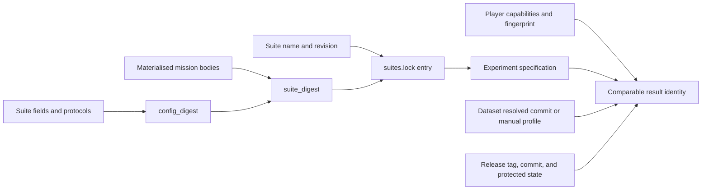

# Suites, revisions, and comparability

A result is comparable only when the inputs that define the measurement agree. The GPTNT package
version alone does not establish that agreement.

## Suite identity

A suite has three related identity values:

- `config_digest` covers the suite configuration except its name, revision, and mission bodies.
- `suite_digest` covers that configuration digest and the materialised mission snapshot.
- `revision` is the human-managed comparison boundary for one suite name.

`gptnt suite freeze` appends the suite name, revision, digest, full configuration, and referenced
mission bodies to `configs/suites/suites.lock`. It refuses changed measured content at an existing
revision. Generation reads the frozen entry rather than the current live suite YAML and copies the
revision and suite digest into every specification.

The suite's `modality` set participates in the configuration digest. Current v2 execution does not
enforce that set against player capabilities, so successful scheduling does not prove modality
compatibility.

## Player and protocol identity

Specifications store player names and role protocols. Runtime records add the resolved
`PlayerCapabilities` for each role. Submission groups a Defuser by the capability fingerprint, not
only by its display name. The same model name with different reasoning, output, coordinate, image,
or usage-limit capabilities belongs to a different group.

The experiment fingerprint identifies a frozen mission, suite, manual profile, and role protocols.
It excludes the attempt number and player names. Those excluded values still matter when deciding
which execution and attribution a row represents.

## Manuals, missions, and datasets

The suite lock stores each materialised mission body by `mission_key`. The key includes the sorted
module identifiers, mission seed, and rule seed. An interactive submission contains a reduced lock
with one suite revision and exactly its referenced missions.

The manual profile is also copied into each specification and result. Manual preparation and source
provenance are explained in [Manuals](../run-and-submit/prepare-manuals.md).

Static identity uses the task name, Hugging Face repository and split, requested revision, and
resolved commit. Only the resolved commit pins a dataset. An unavailable commit is recorded as
unpinned and produces a validation warning.

## Benchmark provenance

Every recorded output includes the installed GPTNT version, exact annotated release tag, release
commit, and `protected_content_modified` state. Permitted runner inputs such as player, suite,
mission, and run files may vary. Protected source, prompts, base configuration, and manual inputs
must match the tagged release for submission.

!!! warning "Match the complete identity"
    Compare suite name, revision, suite digest, mission snapshot, role protocols, player
    capabilities, manual profile, release provenance, and any static dataset commit. Matching only
    a version, suite name, or model label can combine different measurements.

The current submission workflow requires `multi-self-async`, `multi-self-sync`, and
`single-parametric-sync`, plus the explicit `expert-vqa-no-manual` static target.
